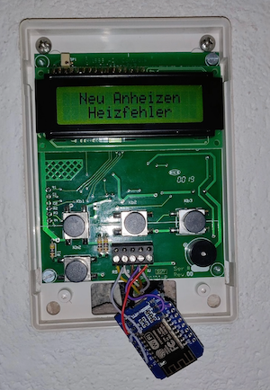

# Kachelofen
Yep germans, pretty uncreative name :D
I wrote this little tool to make our tile stove smart.
In the past you always had to remember to put wood on the fire - or sit in the cold.
Fortunately, the stove already had an electric air supply control to allow for environmentally friendly burning.

After hooking up a scope and a logic analyzer to the control unit, I realized that the (accessible) display 
unit just receives text over RS232 from the (not accessible) main unit. Easyyy. So I hooked up a MAX232 to an 
ESP8266, connected this to the RX line of the display unit and hid it inside the plastic cover.

The software reads the display content and parses the status and the temperature of the stove and publishes this to some MQTT topics.
This gets read by Homeassistant where I use NodeRED to act based on too low temperature or failure states. 
This then triggers a spoken notification to my 8 (:D) Alexas telling me what to do now.

